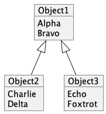
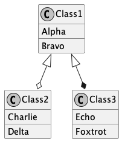
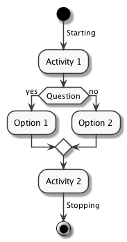
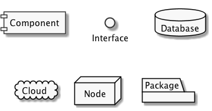
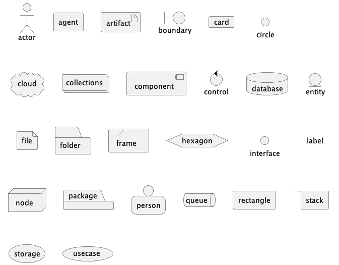
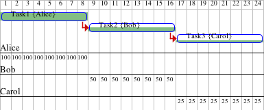
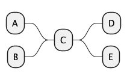
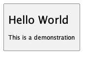
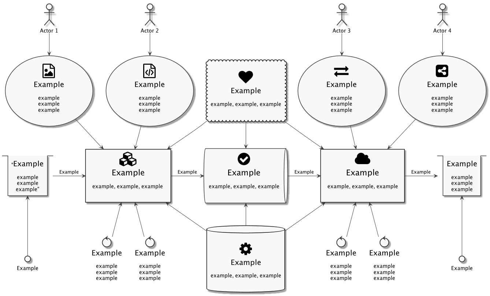
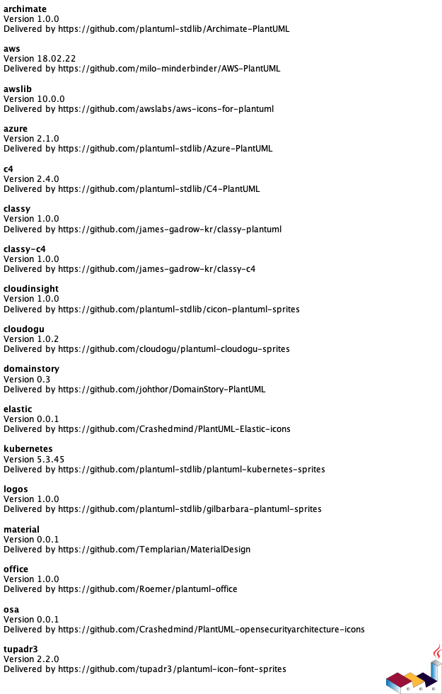

# PlantUML

PlantUML is a tool that uses text formatting to create graphic diagrams. See http://plantuml.com

PlantUML offers many kinds of diagrams for UML, as well as for timing diagrams, Gantt charts, mind maps, C4 models, and more. This page shows beginner examples of PlantUML images and text.


## Sequence diagram


```plantuml
@startuml
skinparam monochrome true
Alpha -> Bravo
Bravo -> Alpha
@enduml
```


## Sequence diagram with steps and divider


```plantuml
@startuml
skinparam monochrome true
Alpha -> Bravo: Step 1
Bravo -> Charlie: Step 2
== My Divider ==
Charlie -> Bravo: Step 3
Bravo -> Alpha: Step 4
@enduml
```


## Sequence diagram with participant shapes


```plantuml
@startuml
skinparam monochrome true
participant Participant as Foo
actor       Actor       as Foo1
boundary    Boundary    as Foo2
control     Control     as Foo3
entity      Entity      as Foo4
database    Database    as Foo5
collections Collections as Foo6
queue       Queue       as Foo7
Foo -> Foo1 : To actor 
Foo -> Foo2 : To boundary
Foo -> Foo3 : To control
Foo -> Foo4 : To entity
Foo -> Foo5 : To database
Foo -> Foo6 : To collections
Foo -> Foo7: To queue
@enduml
```


## Usecase diagram


```plantuml
@startuml
skinparam monochrome true
left to right direction
User1 --> (Story1)
(Story1) --> (Story2)
(Story2) --> (Story3)
@enduml
```


## Object diagram



```plantuml
@startuml
skinparam monochrome true

object Object1 {
  Alpha
  Bravo
}

object Object2 {
  Charlie
  Delta
}

object Object3 {
  Echo
  Foxtrot
}

Object1 <|-- Object2
Object1 <|-- Object3
@enduml
```


## Class diagram



```plantuml
@startuml
skinparam monochrome true

' If you want to hide the "C" circle, then uncomment this line:
' hide circle

class Class1 {
  {field} Alpha
  {method} Bravo
}

class Class2 {
  {field} Charlie
  {method} Delta
}

class Class3 {
  {field} Echo
  {method} Foxtrot
}

Class1 <|--o Class2
Class1 <|--* Class3
@enduml
```


## Entity relationship diagram (ERD)


```plantuml
@startuml
skinparam monochrome true
skinparam linetype ortho

' If you want to hide the "E" circle, then uncomment this line:
' hide circle

entity Entity1 {
  Alpha
  Bravo
}

entity Entity2 {
  Charlie
  Delta
}

entity Entity3 {
  Echo
  Foxtrot
}

Entity1 }o-down-o{ Entity2
Entity1 }o-down-o{ Entity3
@enduml
```


## Package styles


```
@startuml
package "Demo Node" <<Node>> {
  object Object1
}
package "Demo Rectangle" <<Rectangle>> {
  object Object2
}
package "Demo Folder" <<Folder>> {
  object Object3
}
package "Demo Frame" <<Frame>> {
  object Object4
}
package "Demo Cloud" <<Cloud>> {
  object Object5
}
package "Demo Database" <<Database>> {
  object Object6
}
@enduml
```


## Activity diagram



```plantuml
@startuml
skinparam monochrome true
start
-> Starting;
:Activity 1;
if (Question) then (yes)
  :Option 1;
else (no)
  :Option 2;
endif
:Activity 2;
-> Stopping;
stop
@enduml
```


## Component diagram of items



```plantuml
@startuml
skinparam monochrome true
component "Component"
interface "Interface"
database "Database"
cloud "Cloud"
node "Node"
package "Package"
@enduml
```


## State diagram


```plantuml
@startuml
skinparam monochrome true
[*] --> State1 : Start
State1 -> State2 : Change1
State2 -> State3 : Change2
State3 --> [*] : Stop
State1 : Description 1
State2 : Description 2
State3 : Description 3
@enduml
```


## Deployment diagram of items



```plantuml
@startuml
skinparam monochrome true
actor actor
agent agent
artifact artifact
boundary boundary
card card
cloud cloud
component component
control control
database database
entity entity
file file
folder folder
frame frame
interface  interface
node node
package package
queue queue
stack stack
rectangle rectangle
storage storage
usecase usecase
@enduml
```


## Timing diagram


```plantuml
@startuml
skinparam monochrome true
concise "My Timeline" as T
@T
0 is Alpha
+100 is Bravo
+100 is Charlie
@50 <-> @+100 : My Note
@enduml
```


## Diagrams through ASCII art (DITAA)

```plantuml
@startuml
ditaa
+--------+   +-------+    +-------+
|        +---+ ditaa +--> |       |
|  Text  |   +-------+    |diagram|
|Document|   |!magic!|    |       |
|     {d}|   |       |    |       |
+---+----+   +-------+    +-------+
    :                         ^
    |       Lots of work      |
    +-------------------------+
@enduml
```


## Wireframe


```plantuml
@startuml
salt
{
  Hello world
  [Button]
  ()  Radio 1
  (X) Radio 2
  []  Checkbox 1
  [X] Checkbox 2
  "Enter text here   "
  ^This is a droplist^
}
@enduml
```


## Gantt chart



```plantuml
@startgantt
skinparam monochrome true
[Task1] on {Alice} lasts 8 days
then [Task2] on {Bob} lasts 4 days at 50%
then [Task3] on {Carol} lasts 2 days at 25%
@endgantt
```


## Mind map



```plantuml
@startmindmap
+ C
++ D
++ E
-- A
-- B
@endmindmap
```


## OpenIconic


```plantuml
@startuml
title: <&heart> Demo <&heart>
@enduml
```

OpenIconic provides open source icons. OpenIconic is now built-in to PlantUML.


# OpenIconic list


```plantuml
@startuml
listopeniconic
@enduml
```

You can list all the OpenIconic icon names and images by using the special diagram "listopeniconic".


## Font Awesome


```plantuml
@startuml
skinparam monochrome true
!include <font-awesome/star>
rectangle "<$star>"
@enduml
```


## Procedure



```plantuml
@startuml

!procedure $demo($name, $headline, $description)
  card $name as "\n<size:22>$headline</size>\n\n<size:12>$description</size>\n"
!endprocedure

$demo(MyCard, "Hello World", "This is a demonstration")

@enduml
```


## Procedure layout


```plantuml
@startuml
skinparam monochrome true
skinparam defaultTextAlignment center

!procedure $layout($shape, $name, $openiconic, $headline, $description)
  $shape $name as "\n\n<size:44><&$openiconic></size>\n<size:22><U+00A0><U+00A0>$headline<U+00A0><U+00A0></size>\n\n<U+00A0><U+00A0>$description<U+00A0><U+00A0>\n\n"
!endprocedure

$layout(card, MyCard, heart, "Hello World", "This is a demonstration")

@enduml
```

This shows how to create your own procedure to create a custom layout with a shape, object name, OpenIconic icon, headline that uses big size text, and a description that uses normal size text.


## Area diagram



[Area diagram PlantUML](doc/area-diagram/area-diagram.txt)

The area diagram is an example deployment diagram that shows a bunch of areas and how they interrlate. This example is useful for seeing a real-world diagram, that uses boxes, arrows, Font Awesome icons, multi-line text, Unicode padding, font sizes, and more.


## Standard library



```plantuml
@startuml
stdlib
@enduml
```

You can list standard library folders by using the special diagram "stdlib".


## C4 model


```plantuml
@startuml
!include <C4/C4_Container>

Person(personAlias, "Label", "Optional Description")
Container(containerAlias, "Label", "Technology", "Optional Description")
System(systemAlias, "Label", "Optional Description")

System_Ext(extSystemAlias, "Label", "Optional Description")

Rel(personAlias, containerAlias, "Label", "Optional Technology")

Rel_U(systemAlias, extSystemAlias, "Label", "Optional Technology")
@enduml
```

The C4 Model focuses diagrams on four areas: Context, Containers, Components, Code.

<https://c4model.com/>
